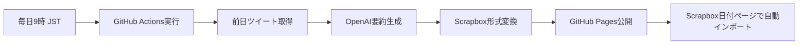

# 📱 X2Scb - Twitter 連携 Scrapbox 日誌テンプレート

> 🚀 **GitHub テンプレートリポジトリ** - 「Use this template」ボタンで、あなた専用の Twitter-Scrapbox 連携システムを作成！

[](https://github.com/tkgshn/X2Scb/generate)
[](https://github.com/tkgshn/X2Scb)
[](https://opensource.org/licenses/MIT)

## 📖 概要

**X2Scb**（Twitter to Scrapbox）は、あなたの日々のツイートを自動収集し、Scrapbox の日付ページに簡単にインポートできる形式に整形するテンプレートシステムです。

### ✨ 主な機能

- 🔄 **GitHub Actions 自動収集** - 毎日定時にツイート・RT を自動取得
- 🤖 **AI 要約機能** - OpenAI 活用でインテリジェントな要約を生成
- 📋 **Scrapbox 完全対応** - 引用形式・リンク付きで完璧にフォーマット
- 🌐 **GitHub Pages デプロイ** - JSON や HTML で簡単データアクセス
- 🔧 **Tampermonkey スクリプト** - ワンクリックで Scrapbox に連携
- 📱 **テンプレート対応** - 設定自動化で即座に利用開始

### 🎯 このテンプレートで得られるもの

テンプレート使用後、以下が**自動で**あなた専用にセットアップされます：

```
あなたのリポジトリ/
├── 🔧 設定済みユーザースクリプト（あなたのGitHubアカウント用）
├── 📚 あなた専用のREADME・SETUP.md
├── 🌐 GitHub Pages用ワークフロー
├── ⚙️ 日次Twitter収集Actions
└── 🎯 ワンクリックTampermonkeyインストールボタン
```

## 🚀 クイックスタート（3 分で完了）

### 1️⃣ テンプレートからリポジトリ作成

**[👆 このテンプレートを使用](https://github.com/tkgshn/X2Scb/generate)** ボタンをクリック

- リポジトリ名: `X2Scb`（推奨）または任意の名前
- Public/Private: お好みで選択
- 「Create repository」をクリック

### 2️⃣ 自動セットアップを待機（約 1 分）

リポジトリ作成後、**GitHub Action が自動実行**されます：

- ✅ サンプルデータのクリーンアップ
- ✅ あなたの GitHub ユーザー名でスクリプト設定更新
- ✅ 個人化された README・セットアップガイド生成
- ✅ Tampermonkey ワンクリックインストールボタン作成

> 📋 自動セットアップが開始されない場合：「Actions」タブ → 「テンプレートリポジトリ設定」→「Run workflow」

### 3️⃣ 更新された README に従って設定

自動セットアップ完了後、あなたのリポジトリの**新しい README**に以下が表示されます：

- 🎯 **あなた専用の Tampermonkey インストールボタン**
- 📋 **5 ステップの簡単設定手順**
- 🔗 **あなたのリポジトリに特化した直接リンク集**

## 🛠️ 設定後の動作フロー



## 📱 使用例

### 自動インポート

Scrapbox の日付ページ（例：`2025/01/18`）を開くと、前日のツイートが自動で取得されます。

### 手動インポート

特定の日付を取得したい場合：

```
https://scrapbox.io/yourproject/2025/01/18?date=2025-01-17
```

### 生成される Scrapbox 形式

```markdown
[* 2025/01/17 のツイートまとめ]
[** 自分のツイート]

> [https://twitter.com/username/status/123456789]
> 今日はプログラミングについて考えていた
> [summary.icon] プログラミングの重要性について言及

[** リツイート]

> [https://twitter.com/i/web/status/987654321]
> 興味深い技術記事を発見
> [summary.icon] 技術トレンドに関する記事の共有
```

## 🎨 カスタマイズ可能な要素

- **実行時刻**: `.github/workflows/daily.yml`の cron 設定
- **AI 要約**: OpenAI プロンプトのカスタマイズ
- **フォーマット**: Scrapbox 出力形式の調整
- **クエリ**: Twitter 検索パラメータの変更

## 📋 必要なもの

- 🆓 **GitHub アカウント**（無料プランで十分）
- 🐦 **Twitter API アクセス**（Bearer Token）
- 🤖 **OpenAI API キー**（要約機能用、オプション）
- 📝 **Scrapbox アカウント**
- 🔧 **Tampermonkey 拡張機能**

## 🆘 サポート・質問

- 📖 **設定で困った場合**: 生成される SETUP.md ファイルを確認
- 🐛 **バグ報告**: [Issues](https://github.com/tkgshn/X2Scb/issues)を作成
- 💡 **機能提案**: [Discussions](https://github.com/tkgshn/X2Scb/discussions)で議論
- 📚 **詳細ドキュメント**: [Wiki](https://github.com/tkgshn/X2Scb/wiki)

## 🤝 コントリビューション

このテンプレートの改善提案やプルリクエストを歓迎します！

1. このリポジトリをフォーク
2. 機能ブランチを作成（`git checkout -b feature/amazing-feature`）
3. 変更をコミット（`git commit -m 'Add amazing feature'`）
4. ブランチにプッシュ（`git push origin feature/amazing-feature`）
5. プルリクエストを作成

## 📄 ライセンス

MIT ライセンス - 詳細は [LICENSE](LICENSE) ファイルを参照してください。

## 🙏 謝辞

- **Twitter API** - ツイートデータ取得
- **OpenAI** - AI 要約機能
- **Scrapbox** - 知識管理プラットフォーム
- **GitHub Actions** - 自動化インフラ

---

> **🚀 今すぐ始める**: 上の「このテンプレートを使用」ボタンをクリックして、あなた専用の Twitter-Scrapbox 連携システムを作成しましょう！
